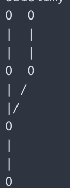
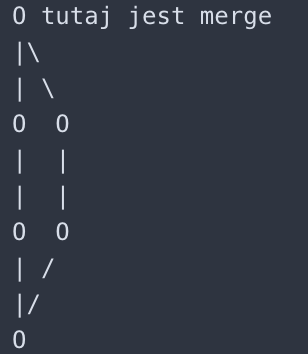
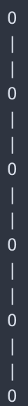
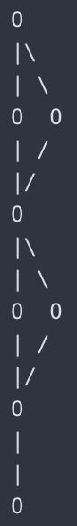
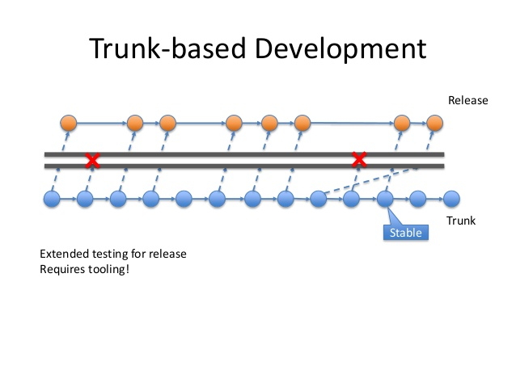

# O Gicie słów kilka(naście)

## Czym jest git?
Git jest systemme kontroli wersji. Pozwala nam on na wersjonowanie naszego kodu - zapisywanie zmian, które w nich zostały zrobione (pod postacią commitów), powracania do poprzednich wersji oraz tworzenie kilku niezależnych wersji obok siebie. Kilka ważnych pojęc:
 * stage - jest to stan naszych zmian, w którym są one zatwierdzone, jednak nie zostały zapisane (zacommitowane)
 * commit - zmiany, które zostały zestage'owane, możemy zacommitowac - zostają one zapisane z odpowiednim komentarzem
 * HEAD - jest to najmłodszy commit w naszej gałęzi

## Instalacja i konfiguracja
Instalacja wygląda inaczej na każdym systemie:
 * Jeśli korzystamy z linuxa, korzystamy z apt:
 ```sudo apt-get update && sudo apt-get install git-core```
 * Jeśli korzystamy z mac os polecam skorzystać z managera paczek o nazwie [homebrew](https://brew.sh/):
 ```brew install git```
 * Jeśli korzystamy z windowsa możemy albo [pobrać instalkę](https://git-scm.com/download/win) albo skorzystać z [konsolowego managera paczek](https://chocolatey.org/): 
 ```choco install git```

Po zainstalowaniu uruchamiamy terminal (w przypadku linuxa oraz mac os) lub git basha (w windowsie). W dalszej części będę się posługiwał słowem terminal. Aby sprawdzić aktualnie używaną wersję gita używamy komendy: 
```
git --version
```
Początkowa konfiguracja gita składa się z podania nazwy naszego użytkownika, maila oraz (opcjonalnie) zmiany naszego edytora tesktowego(służy on do kilku operacji, o których później). Domyslnym edytorem jest vim, ja zmienię go sobie na nano :)
```
git config --global user.name "Jan Kowalski"
git config --global user.email "jan@kowalski.pl"
git config --global core.editor nano
```

## Pierwsze, lokalne repozytorium
Aby stworzyć nasze pierwsze repozytorium potrzebujemy pusty folder. Odpalamy w tym folderze terminal. Teraz, aby zrobić z naszego folderu repozytorium korzystamy z komendy 
```
git init
```
Komenda ta zainicjalizowała nam repozytorium w folderze, w którym się aktualnie znajdujemy. Teraz tworzymy sobie w naszym folderze plik (może byc tekstowy) z jakąs zawartoscią. Teraz możemy uruchomic komendę 
```
git status
```
Jest to komenda, która pokazuje nam wszystkie zmiany, które zaszły w naszym repozytorium od czasu poprzedniego commita, a więc wszystkie nowe, zmodyfikowane oraz usunięte pliki. Nasz status powinien nam pokazac jeden plik. Teraz za pomocą komendy 
```
git add .
```
dodajemy nasz plik do tak zwanego "stage". Stage jest to stan pliku, w którym został on zatwierdzony (wszystkie zmiany w tym pliku są do wrzucenia) jednak nie została mu przypisana wiadomosc, tak zwany "commit". Commit to punkt, w którym nasze zmiany zostały już zapisane w historii. Do commita można wrócic, można go cofnąc i robic z nim masę innych rzeczy, których tutaj nie omówimy. Mając już nasz plik w stage'u, możemy użyc ponownie 
``` 
git status
```
które tym razem pokaże nam zmiany, które zmiany są do zacommitowania. Aby je teraz zacommitowac używamy komendy
```
git commit -m "Init"
```
W tym momencie stworzylismy commit z trescią "Init". Od tej pory wszystkie zmiany, jakie wykonamy na naszych plikach będą porównywane z tym własnie commitem. Możemy sprawdzic te zmiany za pomocą komendy
```
git diff
```
Pozwala nam ona na sprawdzenie, jakie zmiany zaszły w naszych plikach od czasu ostatniego commita.
Po stworzeniu naszego pierwszego commita możemy uruchomic komendę
```
git log
```
Pozwala nam ona na przejrzenie historii commitów, które znajdują się w naszym repozytorium, w tym ich autora, godzinę i dzień ich stworzenia oraz ich tresc. Do porównywania commitów służy polecenie
```
git diff <commit1> <commit2>
```
Który wyswietli nam różnice pomiędzy dwoma commitami.

Jeżeli chcemy cofnąc się do jakiegos commita (chcemy np sprawdzic, czy w poprzedniej wersji kodu dana funkcjonalnosc działał) za pomocą komendy 
```
git log
```
znajdujemy nazwę commita, do którego chemy się cofnąc. Następnie używamy komendy 
```
git reset <commit name>
```
aby wrócic do danego commita. 

### No dobrze, ale
Co, jesli zacommitowałem jakies zmiany, a teraz chcę je cofnąc? Nic prostszego - za pomocą komendy 
```
git log
```
znajdujemy nazwę commita, do którego chemy się cofnąc. Następnie używamy komendy 
```
git reset --hard <commit name>
```
aby wyrzucic wszystkie zmiany, jakie zostały zacommitowane po tym commicie.


## Zdalne repozytorium i sposoby uwierzytelniania
Czym jest zdalne repozytorium? Jest to miejsce, z którym będziemy synchronizowac nasze lokalne repozytorium. Przez synchronizację mam na mysli pobieranie zmian wrzuconych na zdalne repozytorium przez innych ludzi oraz wysyłanie na niego naszych commitów (czyli de facto zmian zrobionych przez nas). Dla uproszczenia przyjmę, iż takie repozytorium aktualnie posiadamy, ponieważ stworzenie repozytorium na dowolnym serwisie ([github](https://help.github.com/articles/create-a-repo/), [gitlab](https://docs.gitlab.com/ee/gitlab-basics/create-project.html), [bitbucket](https://confluence.atlassian.com/bitbucket/create-a-git-repository-759857290.html)) jest banalnie proste dzięki instrukcjom. Ja stworzyłem to repozytorium, w którym aktualnie się znajdujemy, na githubie. 
Po przejsciu do nowo stworzonego repozytorium ukaże nam się link, który posłuży nam do łączenia się z naszym zdalnym repozytorium. Jednak zauważmy, iż jest on w dwóch wersjach: https oraz ssh. Czym się one różnią? Sposobem uwierzytelniania. Podczas używania linku z https aby móc synchronizowac nasze zmiany ze zdalnym repozytorium musimy podac login oraz hasło.Z kolei podczas korzystania z ssh potrzebujemy klucza ssh. Klucze te służą do uwierzytelniania nas podczas własnie wysyłania danych na zdalne repozytorium lub logowania ssh do innych maszyn. Wygenerowany klucz podpinamy do naszego konta a następnie za jego pomocą uwierzytelniamy się podczas wysyłania naszych zmian. Podpinanie klucza ssh przykładowo dla bitbucketa możecie znaleźc [tutaj](https://confluence.atlassian.com/bitbucket/set-up-an-ssh-key-728138079.html).

Tak więc mając już link do repozytorium czas się do niego podpiąc. Ja skorzystam z uwierzytelniania ssh, ponieważ zmieniłem ostantio hasło na githubie i nie wiem, jakie jest. Mając już gotowe lokalne repozytorium oraz puste repozytorium zdalne możemy za pomocą komendy
```
git remote add origin git@github.com:KNKredek/GitIsGit.git
```
ustawic tak zwany "origin". Jest to od tej chwili punkt odniesienia naszego repozytorium. To z nim będziemy się synchronizowac. Aby sprawdzic, jaki jest origin naszego lokalnego repozytorium używamy komendy 
```
git remote -v
```
Wyswietli nam się link, który podalismy w poprzedniej komendzie. Jesli jednak zdecydujemy się na zmianę linku do naszego zdalnego repozytorium (zmiana platformy, zmiana sposobu uwierzytelniana) możemy to zrobic komendą
```
git remote set-url origin https://github.com/KNKredek/GitIsGit.git
```
Od tego momentu (w tym przypadku) będziemy się sychronizowac za pomoca https, a nie ssh.

Okej, czas się więc zsynchronizowac. Lecz co to w ogóle znaczy? Otóż synchronizacja to nic innego jak pobranie zmian (commitów), które znajdują się na zdalnym repozytoirum oraz wysłanie commitów, które mamy lokalnie, jednak nie ma ich jeszcze na zdalnym repozytorium. Do synchronizacji w najbardziej podstawowej wersji służą w zasadzie 3 komendy:
```
git fetch
git pull --rebase
git push
```
Co one robią? Git fetch pobiera nam informacje o zmianach, które zaszły w naszym zdalnym repozytorium, a więc po prostu wszystkie commity, które zostały na niego wrzucone przez innych ludzi. Git pull działa podobnie jak fetch, jednak dodatkowo aplikuje zmiany, które się tam znajdują, do naszego lokalnego repozytorium. W dalszej częsci opracowania opowiem, dlaczego zalecam używac go z flagą --rebase. Ostatni jest git push - tak jak git pull aplikuje zdalne commity do naszego repozytorium, tak git push aplikuje commity z naszego lokalnego repozytorium do repozytorium zdalnego. Należy pamiętac, że przed zrobieniem push MUSIMY zrobic pull, inaczej git nie będzie potrafił zaaplikowac naszych zmian na zdalne repozytorium, bo nie będzie wiedział, co z nimi zrobic. To my, robiąc pull --rebase, mówimy mu, że nasze zmiany znajdują się tuż po tych, które już tam, a następnie wysyłamy nasze lokalne zmiany za pomocą push.

Tak więc prawie jestesmy w domu - aby wykonac nasz pierwszy commit używamy komendy 
```
git push -u origin master
```
Dlaczego tak? Ponieważ nasze zmiany znajdują się aktualnie w branchu master w naszym lokalnym repozytorium (więcej o gałęziach będzie za chwilę). Git w momencie, w którym dodajemy do istniejącego lokalnego repozytorium origin, nie wie, jakie branche odpowiadają jakim branchom. Tak więc komenda, której teraz użylismy, mówi mu, że nasz lokalny master ma byc synchronizowany z masterem na zdalnym repozytorium.

### No dobrze, ale
Co, jesli dostajemy zdalne repozytorium z już wrzuconym jakims kodem? Jak to pobrac? Do pobrania istniejącego repozytorium służy komenda
```
git clone https://github.com/KNKredek/GitIsGit.git
```
Stworzy nam ona lokalnie folder, zainicjalizuje w nim gita oraz automatycznie ustawi naszego mastera na synchronizowanie z masterem ze zdalnego repozytorium. Oczywiscie do tak sklonowanego repozytorium również możemy zmienic remote oraz robic wszystko, co robilismy do tej pory ;>

### No dobrze, alex2
Co, jesli zacommitowałem i spushowałem jakies zmiany, a teraz chciałbym je cofnąc?

Takiego commita najlepiej "zrevertowac". Rever to operacja, która służy do cofania zmian wprowadzonych w commicie. Aby ją wykonac za pomocą komendy 
```
git log
```
szukamy nazwy naszego commita. Następnie komendą 
```
git revert <commit name>
```
robimy revert. Po zatwierdzeniu wiadomosci w naszym commicie zamykamy edytor tekstowy. Zmiana zostanie automatycznie zacommitowana.

## Gitignore
Zdarza się, iż w naszym repozytorium znajdują się pliki, których nie chcemy wrzucac na zdalne repozytorium. Zazwyczaj takimi plikami są pliki wyjsciowe naszego programu, lokalne ustawienia visual studio lub pobrane paczki nuget. Aby powiedziec naszemu gitowi, iż te konkretnie foldery i pliki mają zostac przez niego pominięte, musimy stworzyc w naszym repozytorium plik o nazwie .gitignore. Jest to zwykły plik tekstowy, w którym wpisujemy nazwy plików oraz folderów, które chcemy pominąc. W pliku .gitignore w tym repozytorium znajdują się przykładowy plik oraz folder. Należy zauważyc, iż przykładowy plik jest z gwiazdką. Dlaczego? Ponieważ chcemy, aby każdy plik z tą nazwą, niezależnie od rozszerzenia, był ignorowany

### No dobrze, ale
Co zrobic, jesli w naszym repozytorium już zostały zacommitowane i spushowane jakies zmiany? Samo dodanie do .gitignore nie pomoże - pliki nie będą przez gita synchronizowane, jednak dalej będą znajdowały się na zdalnym repozytorium i nam bruździły. W takim przypadku usuwamy niepotrzebne pliki, commitujemy, dodajemy plik gitignore i dopiero wtedy robimy push. Dzięki temu nasze pliki zostaną usunięte również ze zdalnego repozytorium.

## Branche
Czym są branche? Można je porównac do różnych scieżek rozwoju naszego repozytorium. Są one od siebie wzajemnie niezależnie (przynajmniej do czasu połączenia). W każdym repozytorium znajduje się branch o nazwie master. Jest to główna scieżka rozwoju, którą posiada każde repozytorium. W momencie stworzenia nowego brancha nasz kod dzielimy na dwie (w tym przypadku) wersje, które możemy rozwijac niezależnie od siebie:



Lewa gałąź powyższego drzewa to nasz master - wrzucamy sobie na niego commity, żyje sobie. Prawa gałąź to z kolei branch, którego stworzylismy - na niego również wrzucamy commity, jednak ani master, ani nasz nowy branch nie widzą zmian na drugim branchu. Dzięki temu możemy utrzymywac dwie, zupełnie różne wersje tego samego kodu oraz rozwijac w jednym projekcie dwie zupełnie nowe funkcjolanosci, nie przeszkadzając sobie wzajemnie w pracy.
Aby stworzyc branch używamy komendy
```
git branch <branch name>
```
W tym momencie zostanie stworzony branch o nazwie podanej przez nas. Aby wyswietlic listę aktualnie posiadanych branchy lokalnych używamy komendy 
```
git branch -a
```
z kolei aby wyswietlic listę branchy zdalnych używamy komendy
```
git branch -r
```
Mając już stworzony branch musimy się na niego przełączyc. Wykonujemy to komendą
```
git checkout <branch name>
```
W tym momencie znajdujemy się na naszym branchu. Możemy na niego wrzucac commity tak samo jak na mastera. Jesli stworzylismy brancha lokalnie i chcemy go wrzucic do zdalnego repozytorium, po prostu używamy komendy 
```
git push -u origin <branch name>
```
Komenda ta stworzy na zdalnym repozytorium brancha o takiej samej nazwie jak nasz branch lokalny.

### No dobrze, ale
Co, jak już mam zdalnego brancha i chciałbym się na niego przełączyc? Nic prostszego, wystarczy komenda
```
git checkout --track origin/<branch name>
```
Która automatycznie stworzy nam lokalnie brancha i ustawi go na synchronizowanego z tym zdalnym.

## Merge i rebase
Mamy już dwa branche. Co możemy teraz z nimi zrobic? POŁĄCZYC. I do tego własnie służy nam merge oraz rebase. Lecz czym one się różnią?

### Merge
Merge jest to operacja połączenia dwóch branchy z zachowaniem ich historii. Można to porównac do połączenia się dwóch dróg - od pewnego momentu po prostu nasz kod jedzie jedną, która jest dalej rozwijana. Posiłkując się przykładem z rozdziału o branchach merge naszego nowego brancha do mastera wygląda tak:



Tak więc wszystkie zmiany, jakie zostały naniesione na nasz kod w nowym branchu i w masterze zostały scalone - zachowalismy obie wersje, jednak dalej będziemy pracowac już na masterze. Oczywiscie nic nie stoi na przeszkodzie, aby dalej pracowac na nowym branchu oraz robic kolejne merge do mastera ;>

Aby wykonac merge brancha do mastera musimy przełączyc się na branch master
```
git checkout master
```
a następnie wykonac komendę
```
git merge --commit <branch name>
```
która zrobi merge brancha, którego nazwę podajemy do brancha, w którym się aktualnie znajdujemy (w tym przypadku master).

### Rebase
Rebase, w przeciwieństwie do merge, scala nam nie tylko kod, lecz również historię commitów. Tak więc nasze dwa branche, które wyglądały tak:


teraz będą wyglądały tak:



Aby wykonac rebase brancha, na którym aktualnie się znajdujemy, z branchem, który został stworzony, musimy przełączyc sie na naszego brancha (w tym przypadku master)
```
git checkout master
```
a następnie wykonac komendę
```
git rebase <branch name>
```
która zrobi rebase brancha, w którym się aktualnie znajdujemy (w tym przypadku master) na branchu, którego podamy. Historia zmian z tamtego brancha zostanie scalona z naszą.

Pamiętacie git pull --rebase? Czym jest git pull - git pull jest to komenda, która, aby pobrac zmiany ze zdalnego repozytorium najpierw wykonuje git fetch, a następnie wykonuje merge naszych zmian do brancha, w którym się znajdujemy. wykonując często pull mamy taką oto sytuację:



Aby tego uniknąc zalecam stosowanie komendy git pull --rebase - dzięki temu pull zamiast merge robi rebase, zachowując nasze "drzewko" w dosyc prostym stanie.

### No dobrze, ale
Co, jesli dwie osoby zmieniły tę samą linijkę w tym samym pliku?
Jest to tak zwany "konflikt" (conflict) i należy go rozwiązac. Po napotkaniu takiego conflictu nasz merge/rebase zatrzyma się. W pliku, w którym ten conflict wystąpił, zostaje on oznaczony w taki sposób(musiałem usunąć po jednym znaczku, ponieważ git widział go jako conflikt :D):
```
<<<<<< HEAD
wersja linijki z mastera
=======
wersja linijki z brancha feature
>>>>>> feature
```
W tym momencie jedyne, co należy zrobić, to usunąc oznaczenie i stworzyc wersję, jaką chcemy zachować, np
```
wersja linijki, którą chcemy pozostawić
```
Po wprowadzeniu naszych zmian odpalamy komendę
```
git add .
```
W tym momencie możemy kontynuować nasz merge/rebase za pomocą komendy
```
git merge --continue
git rebase --continue
```
W przypadku wieeeeelu zmian oczywiście ręcznie zmienianie jest niewskazane, polecam narzędzia takie jak kdiff3 lub dodatek git lens do visual studio code ;>

## Workflow
W większych firmach podczas prac przy repozytorium są ustalane tak zwane "workflowy". Jest to zbiór zasad, którymi kierują się programisci podczas pracy z gitem. Dwa przykładowe to Git flow oraz Trunk Based development.

### Git flow (gf)


Jak to działa? 


Mamy dwa główne branche - dev(elop) oraz master. Programisci tworzący nowe funkcjonalnosci tworzą nowe branche, nazwane features, z brancha dev. Po skończeniu kodowania gałąź feature jest mergeowana do gałęzi dev. Po tym mergeu zostaje stworzona gałąź release, z której kod jest wrzucany na jakies srodowisko testowe. Po udanych testach na srodowisku robimy merge do mastera, z którego kod ląduje bezposrednio na produkcji. W rzypadku szybkich poprawek (tak zwanych hotfixów) tworzone są one z mastera, następnie mergeowane do mastera i do dev, a kod z mastera trafia na produkcję.

### Trunk Based Development (tbd)


Tutaj mamy dwa branche - master oraz release. Zasada jest prosta - wychodzimy nowym feature z mastera, po skończeniu kodowania robimy merge do mastera, następnie robimy merge mastera do release. Kod z release, po udanych testach, trafia na produkcję. Hotfixy tworzone są z brancha release, następnie mergeowane z branchem master oraz release.